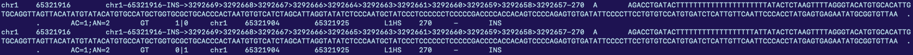

# 20 July 2026

I'm pickin up where we left off with Juan's suggestions.

## Xiaoyu intersection fixes

A few design changes that I implement for the new insertion changes.

* I no longer include non-reference deletions (i.e. reference insertions) because they show up differently in the .bed file and I would rather not build contingencies for them (decreases identifiable TEs)
* I no longer expand INS by feature length and bedtools intersect -r. Instead, I slop by 10 bp symmetrically for all INS in the Xiaoyu .bed file and intersect with the VCF.

Start by grepping out the INS.

```bash
grep -e "INS" l1meaid_hprc2_te.bed > limeaid_ins.bed
```

Then we slop the insertions by 10 base pairs on either side (20 bp of span).

```bash
bedtools slop -b 10 -g "/scratch/atran/final/3_pangenie/input_files/CHM13v11Y.fa.fai" -i limeaid_ins.bed > limeaid_ins_slop.bed
```

### Non-reference TEs in F1, unphased

We intersect it directly with the F1 genotyping results to get a handle on what outputs look like. Some inspection of the results reminds me that we need to filter out homozygous ref--as there can be multiple alternate alleles that pile up at a locus that are all rejected in favor of ref. If we intersect without filtering, it will look like all of the alternate alleles are present in the unphased slop, but really that's just multiple rejections of different alleles at a single location.

I also filter for insertions in the genotyping vcf to get rid of the obviously wrong things. Remember, we are constraining ourselves to non-reference insertions.

```bash
bcftools view -i "GT='alt' && ID~'INS'" /scratch/atran/final/3_pangenie/vcfs/F1_genotyping_biallelic.vcf | bedtools intersect -a stdin -b inputs/limeaid_ins_slop.bed -wo > results/te_match/F1_unphased_slop.txt
```

That yields **1484 records**. Using <code>scripts/match_records.sh results/te_match/F1_unphased_slop.txt results/te_match/F1_unphased_slop_body.txt</code> to quickly prune for being within 10% of allele length yields **1252 matches** (at results/te_match/F1_unphased_slop_body.txt). Not bad!

### Non-reference TEs phased across all samples

A similar command:

```bash
bcftools view -i "GT='alt' && ID~'INS'" /scratch/atran/pangenie-te/5_phasing/results/phased_complete.bcf | bedtools intersect -a stdin -b inputs/limeaid_ins_slop.bed -wo > results/te_match/any_phased_slop.txt
```

Finds **340 phased TEs across all samples**. That is, this guarantees that at least one sample has a non-reference insertion that overlaps Xiaoyu's bed files, slopped.Of course, Juan notes that we should expect bad phasing over the entirety of a chromsome. But this is better than before, especially since we are already filtering for ALT here and ignoring reference insertions!

We also can perform a check with the match_records.sh script (this requires some small edits to what columns awk should read for the length and type of the TE), yielding **273 TEs** at <code>results/te_match/any_phased_slop_body.txt</code>. This is pretty much identical to the feature length intersection I did, but at least I can confirm this one is pretty robust.

### Phased non-reference TEs in F1

We can also subset to a specific sample, then subset to non-reference insertions, and then intersect to see what TEs belong to a specific sample that are phased.

```bash
bcftools view -s F1 /scratch/atran/pangenie-te/5_phasing/results/phased_complete.bcf | bcftools view -i "GT='alt' && ID~'INS'" - | bedtools intersect -a stdin -b inputs/limeaid_ins_slop.bed -wo > results/te_match/F1_phased_slop.txt
```

A run of match_records.sh yields **138 length matched non-reference TEs that are phasable in F1**! Note that there are some duplicate records where the SVs are just ever so slightly different, but get phased onto different haplotypes! There's not really much we can do here.



### Phased, non-reference, breakpoint-validated TEs in F1

I wrote a very small script that uses awk to print out the columns I need at scripts/format_vcf.sh, that takes a number for the final column from the -wo to write and an input file of a bedtools intersect (typically ending in the _body suffix). Then we can do things like:

```bash
cat <(bcftools view -h -s F1 ../5_phasing/results/phased_complete.bcf) <(bash scripts/format_vcf.sh 10 results/te_match/F1_phased_slop_body.txt) > results/te_match/F1_phased_slop.vcf
```

To cat the header of its origin file with the filtered body to get a valid vcf. We can rapidly zip and index:

```bash
ml samtools
bgzip F1_phased_slop.vcf
bcftools index F1_phased_slop.vcf.gz
```

And then we can intersect with the breakpoint validation set. As Juan reminds us, this is a purely positional intersection!

```bash
bcftools isec -p results/te_match/phased_F1_bp -w1 -n~11 results/te_match/F1_phased_slop.vcf.gz results/pack_and_call/F1/F1_create_diploid_graphs.vcf.gz
```

This yields **54 records**. We can subset to heterozygous loci:

```bash
bcftools view -i '(GT="1|0") || (GT="1|0")' results/te_match/phased_F1_bp/0000.vcf
```

Which bcftools stats tells us contains **20 records**. Better than before!

An increase in the slop radius (from 10 to 20) does yield an increase in the number of recovered variants, from **1252 matches** to **1523 matches** at <code>results/te_match/F1_unphased_slop_body_2.txt</code>. That's a pretty sizable increase, but not so much that it makes the numbers look right. Recall that we expect about 2500 non-reference TEs per donor!

## Next steps

Because increasing the slop radius doesn't fix all of our problems, the main things we still want to focus on are:

* comparison of the old and new bed intersect approaches
* improving the breakpoint callset

That involves:

1. using the newly created graphs to perform new vg call genotyping for a new breakpoint set
2. check the difference between the old and new Xiaoyu intersect approaches
3. if the new approach is verified by step 2, figure out how Xiaoyu's bed file was generated
4. create my own RepeatMasker + L1ME-AID annotation set and compare to Xiaoyu, to see if that explains differences in the number of genotypable TEs