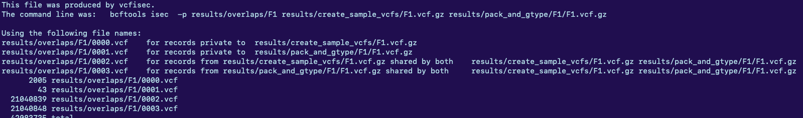

# 5 August 2026

After a week and half of a break or so, I continute on with my work.

Drawing from the list of objectives in 20JUL2026.md, I describe my results on two fronts.

## Genotyping for breakpoint analysis

The main fix was, in fact, to use the phased VCF for all chromosomes, per-sample, in the results/create_sample_vcfs directory.

### Genotyping results for vg construct

A brief look at the statistics for the genotyped VCF indicates the *exact* same number of indels at all sizes between the phased VCF for F1 and the genotyped VCF for F1, using a <code>diff -y</code> between results/pack_and_gtype/F1_bp_stats.txt and F1_phased_stats.txt.

### Proof of correct breakpointing

A simple run of bcftools isec:

```bash
ml samtools
bgzip -k results/pack_and_gtype/F1/F1.vcf
bcftools index results/pack_and_gtype/F1/F1.vcf.gz
bcftools isec results/create_sample_vcfs/F1.vcf.gz results/pack_and_gtype/F1/F1.vcf.gz -p results/overlaps/F1
```

produces:


Shows that the genotyping is essentially exactly identical.

This concordance is so high that I was immediately suspicious. I may consider actually looking at alignments using vg surject and IGV. A priori, however, I have no reasons to disagree with this finding:

 * Looking at vg giraffe shows that it is a real mapper, it uses paths through the graph to narrow the options the mapper has to test for combinations of variant loci that a single read might overlap.
 * Otherwise, though, it just performs gapless alignment!
 * vg call computes read supports on a single snarl (one variant locus), and decides the best one. That means it needs reads to actually map onto the variants in the snarl itself--they need to contain fragments of the variant. There should be no risk of linkage information being used here except in the selection of good paths for vg giraffe.
 * Based off of the PanGenie paper, the recovery of indels with GQ all should be really good anyways!

Without repeatedly actually observing read pileups at the breakpoint I might still be slightly unsure about this, but in the interest of time we can ignore that for now.

Thus, if this finding is true, we can say that PanGenie is actually really, really good at recovering indels of all sorts, validated under tight scrutiny, even with low GQ scores!!!

One caveat is that the construction of these graphs for use by vg giraffe wants phased variation whole-genome. I had the impression that it was required, but it doesn't seem so based on the docs--I may want to consider rerunning this analysis by creating the graph with the _full genotyped unphased VCF_ and running vg giraffe genotyping again. Notably, this should yield worse mapping performance.

## RepeatMasker/L1ME-AID vs. Xiaoyu

### Installing RepeatMasker

I follow the installation instructions at the [RepeatMasker website](https://www.repeatmasker.org/RepeatMasker/).

I install all software on the new Wang lab servers at /wanglab/atran/bin.

* RepeatMasker/4.2.4
* TandemRepeatFinder/4.09.1
* Dfam database with minimum requirements for humans (<code>./famdb.py check human</code>)

### Running RepeatMasker on the unified sample genotypes for non-reference insertions

### Overlapping with Xiaoyu


### Looking at examples on the browser


### Conclusions