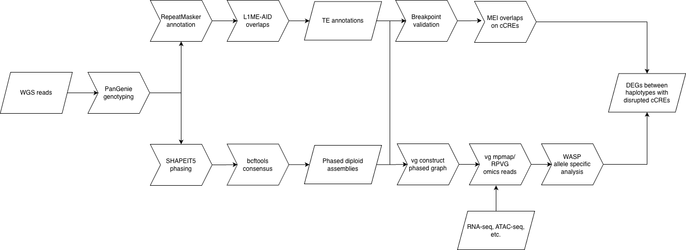

# 6 July 2026

## Meeting with Juan
On Friday, July 3, I met with Juan to discuss the results of analyzing the variants lost through the phasing, described in this slideshow:

<https://docs.google.com/presentation/d/1LVmCAf-2hk2-3wlvMTQud4wLkkE_h3S4AxYL5-EVGh0/edit?usp=sharing>

Some takeaways:

* "issues with merging" is a poorly defined source of error, as the loss of variants from merging is a very specific thing. I should have said something like "complications from complex variants".
* I lost lots of variants because they were missing in the reference panel. Juan suspects that the presence of homozygous reference sites of variation will explain the majority of these lost sites. Also, graphs _depend on the order of the samples that produce them_, because it's kind of like centering a phylogenetic tree. Just because there is a single sample difference between HPRC1 and 2 does not mean there won't be additional differences in the way the sites of variation are set up.
* I took a look at variants that are in the sample and in the panel, but not phased.
  * Juan: <code>-c all</code> uses position, not allele, so he accurately explains the overinflated number of records in the intersect
  * My interpretation of the histogram is dense complex loci + space between those loci. He points out that there are too many "distant"/sparse records, and that is likely driven by sparse variants themselves!
  * Juan also reminds me how phasing works--I know it works "vertically" by finding P(hap|this locus), but remember that as an HMM it also incorporates information "horizontally" across loci, using P(hap|prev locus, next locus).
    * Therefore, sparse variants have little information from nearby variants and can't be easily phased
  * As for the complex variation, their phasing is very difficult and not worth trying! They're so dense, what are the chances they overlap an MEI anyways?
* Broadly, it looks like phasing reproduces the trends we suspect, and it should be ok to move forward with bcftools consensus. Some things to consider:
    * How does filtration of homozygous ref change these numbers? While this isn't perfect (the reference genome possesses some genuinely interesting sites of variation), we can use this to prune a large amount of shared variant loci. Maybe the loss of actually interesting loci isn't that major
    * How about INDELs of the size we care about? Compare it to the numbers I have for F1! bcftools filtering and possibly isec against my previous panel of TEs is a good idea.
    * This might also be the impetus for redoing the PanGenie workflow, except more reproducibly!

## Today's work

### Keyboard shortcuts

A few good keyboard shortcuts to remember for Linux:

<https://askubuntu.com/questions/45521/how-to-navigate-long-commands-faster>

* Cntrl-A to go to the beginning of the line
* Cntrl-E to go to the end of the line
* Alt-B to go back one line
* Alt-F to go forward one line
* Alt-D to the end of the word
* Cntrl-X + Delete to clear the line
* Alt-. to get the last argument of the previous command

<https://stackoverflow.com/questions/68372/what-is-your-single-most-favorite-command-line-trick-using-bash>

* Can substitute arguments in a Snakemake like fashion via e.g.: <code>mv filename{_first,_second}</code>
* Can use expansions to grab the arguments of the previous command e.g. :<code>echo foo bar</code> to <code>echo !:2</code> returns "bar".


### Pipeline diagram slides for Juan (did Juan do the breakpoint analysis?)

The following diagram describes the pipeline for the MEI ASE workflow. The steps are:

* Take input WGS reads
* Genotype using PanGenie
* perform RepeatMasker annotations and overlap with L1ME-AID from Xiaoyu to get annotations of TEs
* meanwhile, phase genotypes with SHAPEIT5 and create diploid assemblies with bcftools
* Use WGS reads to perform a breakpoint analysis (using the diploid assemblies to phase WGS reads) and look for MEI overlaps with known cCREs.
* meanwhile, create a graph of the haplotypes of the donors using vgtools and phase omics reads onto the haplotype graph. Use RPVG to quantify transcripts and reduce to gene level
* perform ASE across haplotypes, yielding a list of DEGs between haplotypes
* link cCRE disruption by MEIs to DEGs between haplotypes



### Testing the phasing numbers

There are a few things to test in the phasing numbers.

* Does filtering out homozygous reference sites change the numbers? That is, the number of variants lost due to being missing in HPRC2, and the number of variants that are in HPRC2 but not phased?
* How about indels? How many were lost of the right size?

First, I use <code>bcftools isec -n~111 -w1 {combined_samples} {phased_vars} {HPRC2}</code>, with the right filenames. This time I don't collapse on position but match on alleles, so we'll see if the numbers match up better with the log files.

Specifically, I use the following bitmasks for the <code>-n</code> flag for the following sets:

* <code>-n~101</code> for S^!P^2, all variants in the sample that are not phased but in HPRC2
* <code>-n~100</code> for S^!P^!2, all variants that are not phased because they are not in HPRC2

I also include a third set, S^P^2, which is just the same as the set P. For each set, I apply the filter:

<code>bcftools view -i '(GT="alt")' {input_set} > {output_set}</code>

This includes all variants that have an alternate allele in them. The point is to look for how much of the non-phasable, non-HPRC2, and phasable variants are actually different kinds of variants, not just reference. Remember, we want lots of non-reference variants because those are the variants that actually let us phase reads down the road. That doesn't mean reference doesn't contain nice variants that could be in our samples, but I decided not to look around for them. The general point is to get a handle on how much variation specific to our samples we might be losing due to different sources of phasing dropout.

We can then directly look at the variants among non-phasable, non-HPRC2, and phasable variants that belong to the matches to Xiaoyu's L1ME-AID annotations (i.e. a test of the phasing of MEIs). We merge the matches to Xiaoyu's L1ME-AID annotations found in the L1ME-AID workflow, and then we find the intersection with all of the input sets.
``` bash
bcftools merge -m none -Ob -o {merged_matches}
bcftools isec -p {set_name} -w1 -n~11 {merged_matches} {input_set}
```

The merged matches are found in <code>/scratch/atran/final/9_xiaoyu</code>, although in the future I should plan to rewrite some of the pangenome process in Snakemake!

### Better programming and testing tips

* Google style guide
<https://google.github.io/styleguide/shellguide.html>
* argument flags
* better Snakemake workflow creation workflow

### Applying it to the bcftools consensus scripts

### How does breakpoint analysis work?